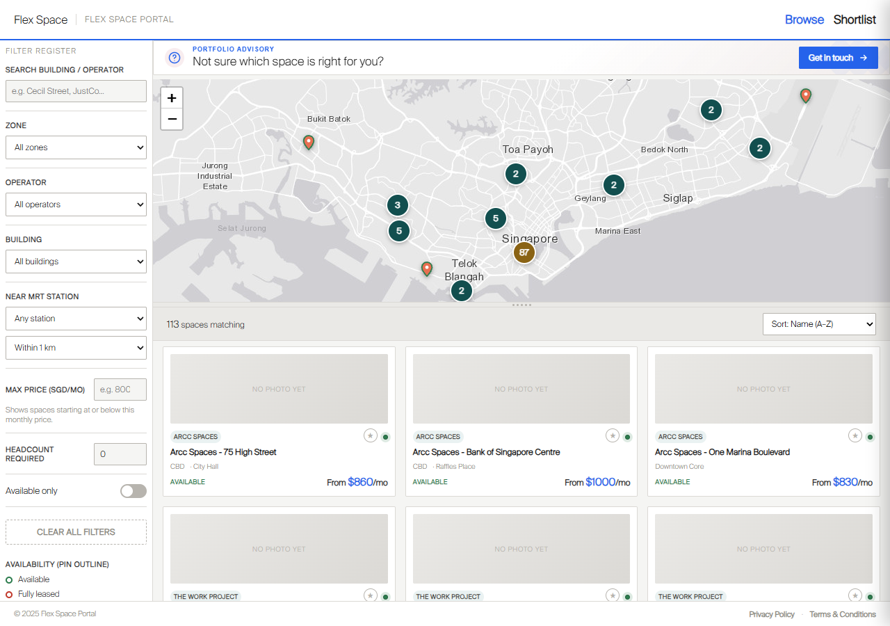
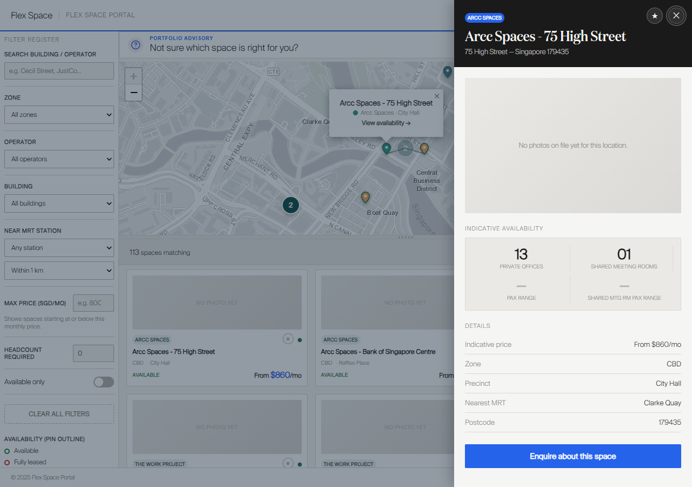
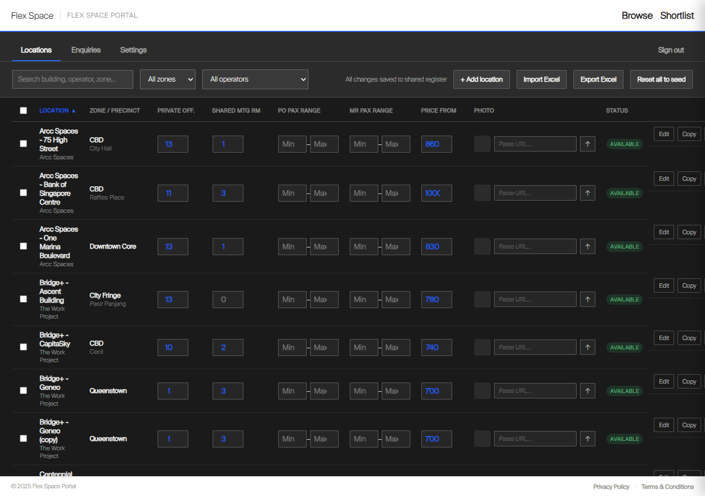

# Flex Space Portal

A register of Singapore flex-space inventory: an interactive map with cascading filters, client shortlists with a printable PDF, enquiry capture, and a full admin back office for managing the register. Vanilla JS front end served by Express, with Supabase (Postgres + Storage) as the data layer.

> **Note:** This is a portfolio showcase. The source code lives in a private repository.

## What it does

- **Browse & filter**: 112 locations on a Leaflet map with cascading filters, where choosing a district narrows the precinct and building lists, and choosing a precinct selects its parent district automatically (every precinct maps to exactly one district, so locality is derived, never typed)
- **Listing detail**: per-location drawer with operator, building, address, per-desk-type stock, pricing and photos; availability is a single source of truth (stock → Available, zero → Fully leased)
- **Shortlists with printable PDF**: visitors build a shortlist and print it as a branded PDF that includes a configurable advisor contact card
- **Enquiry capture**: rate-limited enquiry form with optional email notifications (Resend)
- **Admin back office**: edit the register, bulk-edit, add/soft-delete locations, upload building photos, review and export leads, and full `.xlsx` import/export round-trips
- **OneMap integration**: Singapore's national address register autofills address, postcode and map pin from a lookup; a coordinate audit re-checks every pin against its postcode and offers to move any sitting more than 150 m out

## Tech & architecture

- **Frontend:** vanilla JavaScript, hand-written CSS with design tokens, Leaflet for mapping, SheetJS for `.xlsx`, no framework
- **Backend:** Node.js + Express serving the app shell, a REST key/value store, and admin/enquiry endpoints
- **Data:** Supabase: Postgres tables for locations, MRT stations, key/value overlays and an admin audit log; Supabase Storage for building photos
- **Build:** esbuild minification with content-hashed filenames and a manifest the server reads at boot, so assets are cached for a year and every deploy busts the cache instantly
- **Deploy:** Render.com via `render.yaml` (infrastructure as code)

**Layered location data:** a base seed register is merged at read time with three stored overlays, core-record overrides, admin-added locations and soft-deleted IDs, while stock, price and photos live in a separate inventory key, so editing a location's address never disturbs its availability.

## Security

- Signed, expiring `HttpOnly` session cookies verified server-side on every protected request
- A per-key access policy (default deny): each stored key declares what an unauthenticated caller may read or write; enquiry PII is closed in both directions
- Constant-time credential comparison, progressive delay on failed sign-ins, and an admin audit log
- Helmet with a strict Content-Security-Policy: no inline script permitted
- Body-size limits granted per-request (large photo uploads only for authenticated admins) and per-IP + global rate limits on enquiries
- No default credentials: production refuses to start without admin credentials configured; development generates a random passcode per boot
